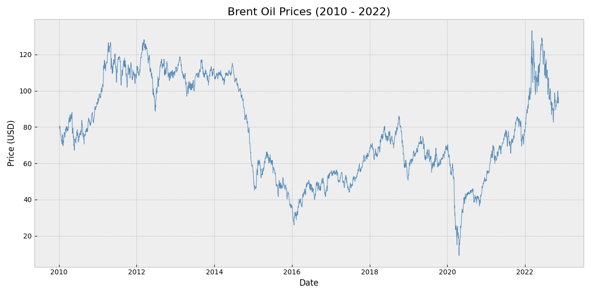
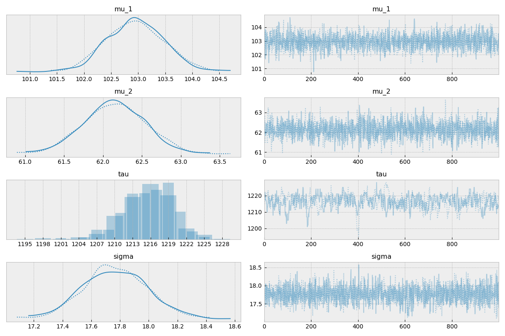
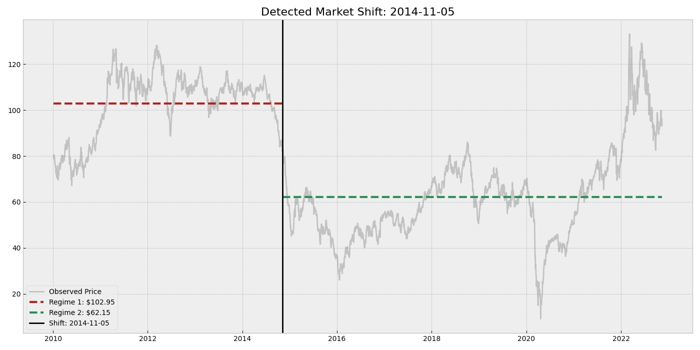

# Bayesian Change Point Detection: Brent Oil Prices

## 📌 Project Overview
**Business Objective:**
Energy markets are defined by periods of high volatility followed by structural regime shifts. For risk managers and quantitative analysts, identifying these breaks is critical for hedging strategies and volatility modeling.

This project utilizes **Bayesian Inference (MCMC)** to mathematically identify structural breaks in Brent Oil prices (2010–2022) rather than relying on visual intuition.

## 📂 Repository Structure
*   `src/`: Python scripts for data ETL and processing.
*   `notebooks/`: Jupyter notebooks containing the Bayesian analysis.
*   `data/`: Raw Brent Oil price data (Source: U.S. EIA).
*   `outputs/`: Generated visualizations and diagnostic plots.

## 📊 Key Findings (Interim Analysis)
Using a Switchpoint model with **PyMC**, we identified a major market regime shift.

### 1. The Data
We analyzed daily spot prices from 2010 to 2022, covering the post-recession recovery, the 2014 crash, and the COVID-19 pandemic.



### 2. The Model
We modeled the price as a sequence of two Normal distributions with a discrete switchpoint ($\tau$).
*   **Method:** Markov Chain Monte Carlo (NUTS Sampler)
*   **Convergence:** $\hat{R} \approx 1.00$ (Perfect convergence)



### 3. Results
The model detected a structural break on **November 5, 2014**, identifying the crash precipitated by the US Shale Boom and OPEC supply decisions.
*   **Regime 1 Mean:** ~$103 USD
*   **Regime 2 Mean:** ~$62 USD



## 🚀 Usage

**1. Install Dependencies**
```bash
pip install -r requirements.txt
```

**2. Run the Analysis**
Open `notebooks/01_interim_analysis.ipynb` and run all cells.

## 📚 Future Work
*   Extend model to $K=2$ change points to capture the 2020 COVID-19 shock.
*   Implement WAIC for model selection.
*   Correlate change points with geopolitical event data.
## 🤝 Contributing & Extensions
This project is designed to be modular. Future extensions could include:
1.  **Hidden Markov Models (HMM):** To detect recurring regimes (e.g., "High Volatility" vs "Low Volatility") rather than structural breaks.
2.  **Multivariate Analysis:** Including covariates like the Dollar Index (DXY) or Global GDP.
3.  **Out-of-Sample Testing:** Validating model predictive power on 2023-2024 data.

**To Contribute:**
1.  Fork the repo.
2.  Create a feature branch (`git checkout -b feature/NewModel`).
3.  Submit a Pull Request with a clear description of the statistical test added.
